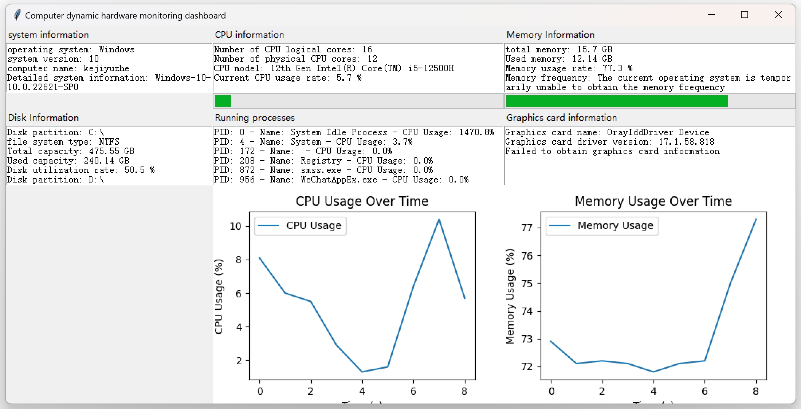

# Computer dynamic hardware monitoring dashboard

<p align="center" class="language" title="Language selection 语言选择">
  <a href="./CompuMon-CN">简体中文</a> | 
  <a href="./CompuMon">English</a>
</p>

<p>Open source protocol：<a href="./CompuMon.txt">Apache-2.0 license</a></p>
<p>Open source address：<a href="https://github.com/UopyTechSpeak/UopyTechSpeak">GitHub</a></p>



## 1、 Project Introduction
The "Computer Dynamic Hardware Monitoring Dashboard" is a practical tool developed based on Python, aimed at providing users with comprehensive and real-time status monitoring services for computer systems and hardware. Through a concise and intuitive graphical interface, it can display detailed information about hardware devices such as CPU, memory, disk, graphics card, as well as system related situations, and dynamically present trends in CPU and memory usage through visual charts, helping users easily grasp the running status of their computer.

## 2、 Function details

### （1） System information monitoring
- **Operating System Details**：It can obtain and display basic information such as the name of the operating system (such as Windows, Linux, etc.), version number, system release version, and system architecture, allowing users to have a clear understanding of the system environment in which the computer is running.
- **Computer Name Display**：Present the name of the current computer in the network for easy identification and differentiation of different devices.

### （2） CPU information monitoring
- **Core quantity statistics**：Accurately display the number of physical cores of the CPU, helping users understand the basic configuration of the CPU's processing capacity.
- **Model identification**：Automatically identify the specific model of CPU installed on the computer, whether it is a common Intel or AMD brand CPU, it can accurately obtain relevant information. This feature is compatible with Windows and Linux operating systems, and achieves corresponding acquisition operations through different system commands and processing logic.
- **Real time tracking of usage rate**：Continuously monitor the real-time usage rate of the CPU and visually display the current usage percentage in numerical form on the interface. At the same time, with the progress bar, it more vividly reflects the busy level of the CPU. In addition, usage data will be collected for generating usage change charts in the future, making it convenient for users to view CPU usage trends over a period of time.

### （3） Memory information monitoring
- **View capacity status**：Display the total capacity and used capacity of computer memory, both in GB units, accurately, allowing users to have a clear understanding of the overall usage of memory.
- **Usage monitoring**：Real time monitoring of memory usage and displaying corresponding percentage values, accompanied by a progress bar to assist users in quickly determining the usage of memory resources.
- **Frequency acquisition (supported by Linux system)**：For the Linux operating system, it is possible to extract the running frequency information of memory and display it to users in "MHz" units, which facilitates understanding of memory performance related indicators.

### （4） Disk information monitoring
- **Partition Details Display**：List the various partitions of the computer disk, including the device identifiers of the partitions (such as the common drive letter format in Windows) and the corresponding file system types (such as NTFS, ext4, etc.), clearly presenting the partition layout of the disk.
- **Capacity usage analysis**：For each disk partition, display its total capacity, used capacity, and disk utilization rate separately, in the form of data to intuitively reflect the utilization of disk space, helping users timely discover whether disk space is tight and other issues.

### （5） Graphics card information monitoring (supported by Windows system)
- **Basic attribute acquisition**：In the Windows operating system environment, key information about the graphics card can be obtained, such as the card's name, driver version number, and graphics memory size (in MB), making it easy for users to understand the basic configuration and driver updates of the graphics card. This is very practical for gamers, graphic designers, and other users who are concerned about graphics card performance.

### （6） Monitoring of running process information
- **Process List Display**：Real time access to all running process information, including the unique identifier (PID), process name, and current CPU usage of the process. Organize this information into a list format for users to view which processes are running and their CPU resource consumption, which helps to identify processes that are abnormally consuming resources.

### （7） Data visualization function
- **CPU Usage Chart**：Based on the collected historical data of CPU usage, draw a line graph of CPU usage over time with time (seconds) as the horizontal axis and usage rate (%) as the vertical axis, clearly presenting the fluctuation of CPU usage over a period of time. The chart has clear axis labels, titles, and legend explanations, making it easy for users to understand. And it will dynamically update chart data to keep displaying the latest usage trends.
- **Memory Usage Chart**：Similarly, visualizing memory usage data and drawing a line graph of memory usage over time to display the dynamic trend of memory usage allows users to intuitively compare the usage patterns of CPU and memory, assisting in judging the overall performance of the computer.

### （8） Automatic update mechanism
All information displayed on the entire interface will be automatically updated every fixed time (default is 1 second), ensuring that users always see the latest real-time status information of the computer, without the need for manual refresh operations, greatly improving the convenience of use and the timeliness of information.

## 3、 Interface Design

### （1） Overview of overall layout
Using the `tkinter` library to build a graphical interface, the `grid` layout is used to divide the interface reasonably. By setting the weights of rows and columns, the interface components can adapt to changes in window size, ensuring good display effects on screens of different resolutions.

### （2） Layout of each functional area
- **System Information Area**：Located on the upper left side of the interface, the system's relevant information is clearly displayed through a combination of text tags and text boxes. The text boxes are set to an appropriate height and width to fully present various system details.
- **CPU Information Area**：Located in the middle position above the interface, there is a text display section containing CPU related information and a usage progress bar. The text section lists various parameters of the CPU in detail, and the progress bar is placed horizontally to visually reflect the current usage of the CPU.
- **Memory information area**：On the upper right side of the interface, the layout is similar to the CPU information area, used to display information related to memory capacity, usage, and corresponding progress bars.
- **Disk Information Area**：Placed on the left side of the interface in the middle, it displays detailed information about disk partitions, capacity usage, and other aspects in the form of a text box. The display content of the text box is automatically adjusted according to the number of disk partitions to ensure that all information is presented completely.
- **Running Process Information Area**：Located in the middle of the interface, it displays detailed information about numerous running processes through a large text box, supports scrolling to view all process content, and facilitates users to browse long lists of process data.
- **Graphics card information area**：Located on the middle right side of the interface, it displays graphics card related attribute information in the Windows system, also presented in text form, making it easy for users to view key graphics card parameters.
- **CPU and Memory Usage Chart Area**：Layout at the bottom of the interface, place the CPU usage chart and memory usage chart in their corresponding positions, occupying an appropriate space ratio to ensure clear and beautiful visualization effects, making it easy for users to observe and compare the usage trends of both charts simultaneously.

## 4、 Technical implementation

### （1） Development Language and Main Libraries
The overall development of the project is based on the Python programming language, mainly relying on the following key libraries to achieve various functions:
- **`tkinter`**: Python's standard GUI (graphical user interface) library, used to create intuitive and easy-to-use graphical interfaces, implement interface layout, component display, and interactive functions, providing a visual operation window for the entire project.
- **`psutil`**: A cross platform library that enables easy access to various information about computer systems and processes, such as data on CPU, memory, disk, processes, etc., providing core data acquisition support for the hardware information monitoring function of this project.
- **`matplotlib`**: A powerful plotting library that combines the `matplotlib.backends.backend_tkagg` module to embed pre drawn charts into the `tkinter` interface for visual display of CPU and memory usage, presenting data trends in intuitive chart form.
- **`subprocess`**: Used to execute external system commands in Python programs, playing a role in obtaining some hardware information (such as CPU model, memory frequency, etc. under different operating systems), by calling system commands and processing the returned results to obtain the required data.
- **`platform`**: Python's built-in standard library is used to obtain basic information related to the system, such as operating system name, version, etc., providing a basic data source for displaying system information.
- **`wmi`（Used under Windows system）**: In the Windows environment, this library can access Windows Management Instrumentation (WMI) to obtain detailed information about hardware devices such as graphics cards. It is a key dependency for implementing graphics card information monitoring function under Windows system.

### （2） Code Structure and Key Functions
- **Modular design of code**：The entire project code is divided into multiple functions based on functionality, with each function responsible for independent functional modules. For example, the `update_system_info` function focuses on updating and displaying system information, while the `update_cpu_info` function is responsible for updating and displaying CPU related information. This design makes the code structure clear, easy to maintain, and expand.
- **Introduction to Key Functions**：
    - `get_cpu_model`：According to different operating systems (Windows or Linux), use corresponding commands and processing logic to obtain the CPU model. If an exception occurs during the acquisition process, return the corresponding error message to ensure the stability and fault tolerance of the program.
    - `update_cpu_usage_data` and `update_memory_usage_data`：These two functions are respectively used to store CPU and memory usage data, stored through a reasonable data structure (list), and set data length limits (such as only retaining the last 60 seconds of data), providing accurate and appropriate data foundation for subsequent chart drawing.
    - `update_cpu_usage_chart` and `update_memory_usage_chart`：Responsible for plotting the latest CPU and memory usage data into charts and updating them to the corresponding positions on the interface, involving a series of operations such as chart creation, data plotting, coordinate axis setting, legend addition, destruction of old chart components, and embedding of new charts, ensuring accurate display and dynamic update of charts.
    - `update_all_info`：As the core scheduling function, it will sequentially call various information update functions to update all relevant information of the computer at once, and set a timer through the `root.after` method to automatically trigger information updates at fixed intervals, ensuring the real-time performance of interface information.

## 5、 Python environment installation

### （1） Under Windows system
1. **Download installation package**：
Visit the official Python website（ https://www.python.org/downloads/ ）Find the Python installation package version suitable for Windows system on the website (usually recommended to choose the latest stable version), click the download button to download.

2. **Run setup**：
After downloading, double-click the installation package to start the installation wizard. During the installation process, it is important to check the "Add Python to PATH" option, which ensures that Python and its related commands can be directly called from anywhere on the command line, facilitating subsequent operations. Then follow the instructions in the installation wizard and gradually click the "Next" button to complete the installation. The installation path can be selected according to personal needs, but it is recommended to use the default path to avoid possible problems.

3. **Verify installation**：
After installation is complete, open the command prompt (press the `Win + R` key, enter `cmd` and enter enter), and enter `python --version` in the command prompt window. If the installed Python version number is displayed correctly, it means that the Python environment installation is successful.

### （2） Under Linux system (taking Ubuntu as an example, other distributions may have slight differences)
1. **Update the system software package list**：
Open the terminal and enter the following command to update the software package list of the system, ensuring that the latest Python installation package information can be obtained:
```bash
sudo apt update
```

2. **Install Python**：
Execute the following command to install Python (Ubuntu system defaults to installing Python 3, here we take installing Python 3 as an example):
```bash
sudo apt install python3
```
During the installation process, the terminal will prompt for the current user's password for authorization. After entering the password (which will not be displayed on the screen during the password input process, which is a normal phenomenon), press Enter to continue the installation and wait for the installation to complete.

3. **Verify installation**：
Enter `python3 --version` on the terminal, and if the installed Python version number is displayed correctly, it indicates that the Python environment has been successfully installed in the system.

### （3） Under macOS system
1. **Download installation package**：
Also visit the official Python website（ https://www.python.org/downloads/ ）Choose the Python installation package version suitable for macOS system (usually the latest stable version), click the download button to download the corresponding installation file.

2. **Run setup**：
After the download is complete, double-click the downloaded `.pkg` format installation file, follow the installation wizard's prompts step by step, and click buttons such as' continue 'and' agree 'until the installation is complete.

3. **Verify installation**：
Open the terminal (you can open it by entering `Terminal` in 'Focus Search' and pressing enter), enter `python --version` in the terminal (if Python 3 is installed, you can also enter 'python3-- version'), and if the corresponding Python version number is displayed correctly, it means the installation is successful.

## 6、 Project advantages and application scenarios

### （1） Project advantages
- **Fully functional**：It covers multiple key hardware devices of the computer and the overall information monitoring of the system, from basic hardware parameters to real-time usage, and then to visual display of data, fully meeting users' needs for understanding the running status of the computer.
- **Real time dynamic monitoring**：Automatically update all information at regular intervals, allowing users to keep track of the latest changes in the computer's status and promptly detect potential performance issues such as high CPU or memory usage, insufficient disk space, etc.
- **Friendly interface**：Through a concise and reasonable graphical interface design, various types of information are displayed in a clear and intuitive way, which can be easily understood and used by both ordinary computer users and professional technicians.

### （2） Application scenarios
- **Daily computer usage and maintenance**：Ordinary users can use this tool to check the real-time status of their computer in their daily use, promptly close unnecessary processes, clean up disk space, etc., ensuring smooth computer operation and improving the user experience.
- **Office Scene**：For office workers, especially users who need to use computers for long periods of time to handle complex tasks, such as software developers, designers, etc., this tool can be used to monitor computer performance, avoid affecting work efficiency due to computer performance issues, and quickly locate abnormal processes that consume too much resources for processing.
- **Computer troubleshooting**：When the computer experiences performance degradation, lagging, and other abnormal situations, technicians can use this tool to view detailed hardware information and real-time usage data, assist in analyzing the cause of the malfunction, quickly identify the problem, and take corresponding solutions.

## 7、 Future prospects
With the continuous development of computer hardware technology and the increasing demand for computer performance monitoring from users, this project can be expanded and optimized in the following aspects in the future:
- **Function expansion**：Add detailed information monitoring functions for more hardware devices (such as sound cards, network cards, etc.) to further improve the comprehensive presentation of computer hardware status; Support more operating system platforms and expand the applicability of tools.
- **Performance optimization**：Optimize algorithms for data acquisition and processing, reduce the use of computer system resources, especially in high-frequency data acquisition and long-term operation, ensuring that the tool itself does not have a negative impact on computer performance.
- **User experience improvement**：Based on user feedback, further beautification and interactive optimization of the interface will be carried out, such as adding data export function to facilitate users to save monitoring data for subsequent analysis; Provide customizable monitoring parameters and update frequency options to meet the personalized needs of different users.

## 8、 Contribution and Feedback
If you have any suggestions, issues, or would like to contribute code to this project, you can contact us through the following methods:

- Submit on GitHub platform：[issues](https://github.com/UopyTechSpeak/CompuMon/issues)
- Send an email to：`kejiyuzhe@gmail.com`

We warmly welcome your feedback and contributions to make this project better together!
